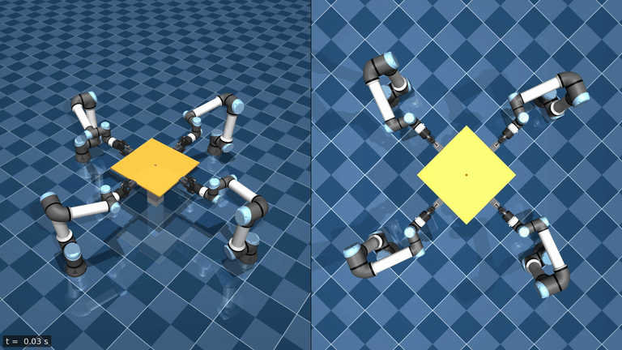

# Four-UR5e Cooperative Object Transportation in MuJoCo

Four UR5e manipulators, each with a Robotiq 2F-85 gripper, grasp a shared rigid
plate, lift it off a post, carry it around a horizontal circle while it moves
sinusoidally in height, and return it to the lift point. The simulation runs
closed loop in MuJoCo; the plate is a free body moved only by gripper contact.

## Demo

[](media/four_ur5e_cooperative_transport.mp4)

Real-time preview; [full-resolution video](media/four_ur5e_cooperative_transport.mp4) (1920×1080, 22 s).
Left: oblique view. Right: top view with the recorded path of the plate.

## System

- **Robots:** four UR5e arms (MuJoCo Menagerie model) with joint-torque actuators
  limited to ±(150, 150, 150, 28, 28, 28) N·m, on the floor 0.90 m from the plate
  centre, 90° apart, facing the plate.
- **Grippers:** Robotiq 2F-85 (MuJoCo Menagerie model, unmodified actuator).
- **Payload:** a 0.50 × 0.50 × 0.012 m plate with four 66 × 50 × 30 mm handles,
  1.0 kg in total, initially resting on a post.
- **Task:** close the grippers, lift by 0.08 m, then one full circle of radius
  0.15 m in 10 s about the lift point, entered and left with a smooth 2 s spiral,
  while the height follows a 0.04 m sinusoid (two periods per circle). The plate
  orientation is held constant.
- **Physics:** time step 1 ms, implicit-fast integrator, elliptic friction cones.

## Control

The controller runs at 1 kHz on the full simulator state.

1. **Payload level.** A PD law on the plate pose gives the desired plate wrench
   `F = m (a_d + Kp e_p + Kd e_v) + m g`, `τ = I (α_d + Kr e_R + Kω e_ω) + ω × I ω`.
2. **Wrench allocation.** The grasp matrix `G` of the four handle points maps the
   gripper wrenches to the plate wrench. The weighted minimum-norm solution
   `f = W⁻¹Gᵀ(GW⁻¹Gᵀ)⁻¹ W_d` distributes the load without internal squeeze and
   penalises gripper moments more than forces.
3. **Arm level.** Each arm follows its desired gripper pose (the desired plate pose
   composed with its handle frame) with a Cartesian impedance, adds its allocated
   wrench as feedforward, and compensates gravity and Coriolis terms:
   `τᵢ = bᵢ(q, q̇) + Jᵢᵀ [Kp Δp + Kd Δv + fᵢ ; Kr log(R_d Rᵀ) + Kω Δω + mᵢ]`,
   with `Jᵢ` the 6×6 Jacobian of the gripper's pinch point.

The initial arm configurations come from damped least-squares inverse
kinematics that places each open gripper at its handle. The grasp is real
contact: each gripper closes vertically across its handle, so the lower pad
carries the load by normal force and pad friction carries the small horizontal
loads. No constraint attaches the plate to the robots.

## Requirements

- Linux x86-64
- [Git](https://git-scm.com/) and [Pixi](https://pixi.sh) (install instructions: https://pixi.sh)
- An OpenGL-capable display for the interactive viewer (any GPU with current
  drivers, including integrated graphics). No NVIDIA GPU or CUDA is required: the
  simulation itself runs on the CPU.

## Quick Start

```bash
git clone https://github.com/shubhankarmondal/four-ur5e-cooperative-transport.git
cd four-ur5e-cooperative-transport
pixi run demo
```

The first run creates the environment from `pixi.lock`, then opens the MuJoCo
viewer and plays the 19.5 s demonstration in real time; afterwards the arms hold
the plate until the window is closed. Without a display the same simulation runs
headless and prints a summary.

## Other Commands

```bash
pixi run demo --headless  # run the demonstration without the viewer and print a summary
pixi run render           # simulate headlessly and write outputs/videos/four_ur5e_cooperative_transport.mp4
pixi run validate         # full validation suite (1–2 minutes)
pixi run test             # unit tests
```

`render` uses offscreen EGL rendering; on systems without EGL, run it with
`MUJOCO_GL=osmesa` (requires the system OSMesa library). `validate` also checks the
rendered video if `pixi run render` has been run first. Results are written to
`outputs/`.

## Project Structure

```
src/homtrans/     scene builder, trajectory, allocation, controller, IK, simulation loop, video renderer
scripts/          demo.py, render.py, run_demo.py, render_video.py, validate.py, build_scene.py, diagnostics/
models/           generated MJCF model (four_ur5e_transport.xml, rebuilt by scripts/build_scene.py)
assets/           MuJoCo Menagerie UR5e and Robotiq 2F-85 models
media/            demonstration video and preview
tests/            unit tests
```

## Reproducibility

Pixi manages Python and all dependencies; `pixi.lock` records the exact resolved
environment. MuJoCo (3.13.0) and NumPy (2.3.5) are pinned to the versions the
demonstration was validated with, and the simulation is deterministic: repeated
runs produce bitwise-identical trajectories.

## Tested Platform

Ubuntu 24.04 LTS (x86-64), Intel Core Ultra 9 285K, NVIDIA GeForce RTX 5090
(driver 580). The simulation is CPU-only; offscreen rendering was also verified
on the CPU's integrated Intel GPU through Mesa, without the NVIDIA driver.

## Limitations

- Simulation only, with perfect state feedback (no sensing, no delay).
- Opening the grippers alone does not release the plate: with the jaws closing
  vertically, the open lower fingers still support it.
- The motion is gentle (peak commanded acceleration about 3 % of g).

## License

The code in this repository is released under the [MIT License](LICENSE).

The robot and gripper models in `assets/` are unmodified copies from
[MuJoCo Menagerie](https://github.com/google-deepmind/mujoco_menagerie)
(revision `8161bba`) and keep their own licenses: the UR5e model is BSD-3-Clause
(© 2018 ROS Industrial Consortium, `assets/ur5e/LICENSE`) and the Robotiq 2F-85
model is BSD-2-Clause (© 2013 ROS-Industrial, `assets/robotiq_2f85/LICENSE`). The
generated `models/four_ur5e_transport.xml` contains modified copies of both models
and those parts remain under their licenses. See
[THIRD_PARTY_NOTICES.md](THIRD_PARTY_NOTICES.md). Universal Robots, Robotiq,
ROS-Industrial and Google DeepMind are not affiliated with this project.
